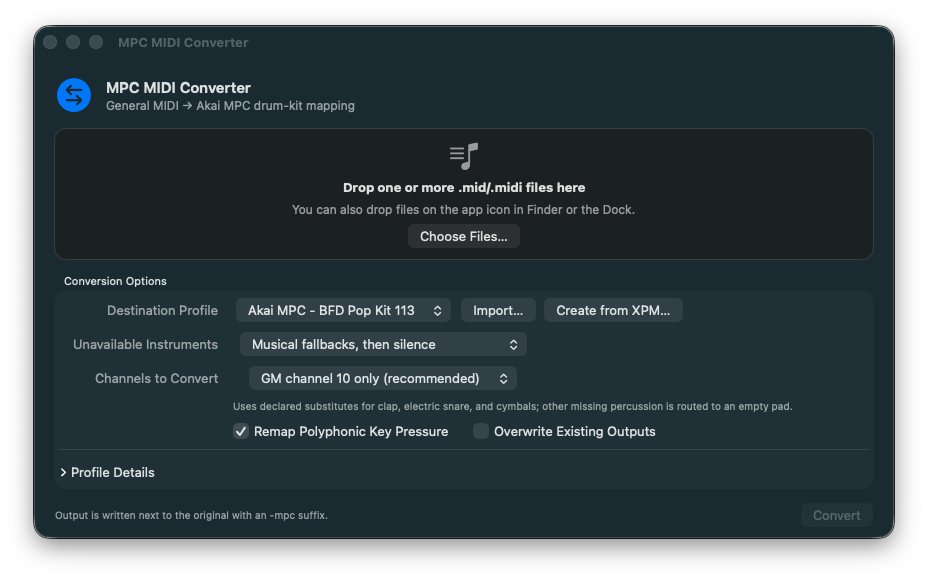

# MPC MIDI Converter



A native macOS app that converts General MIDI drum parts to the pad-note layout
of a specific Akai MPC Drum Program. Your original MIDI file, MPC program,
samples, and velocity layers are never changed.

[Download the latest macOS build](https://github.com/ttessarolo/mcp-midi-converter/releases/latest/download/MPC-MIDI-Converter-macOS-arm64.zip)
· [View all releases](https://github.com/ttessarolo/mcp-midi-converter/releases)

The downloadable build requires macOS 13 or later and an Apple Silicon Mac.
The source can also be compiled locally for the Mac architecture you are using.

## Download and convert

1. Download and unzip `MPC-MIDI-Converter-macOS-arm64.zip`.
2. Open **MPC MIDI Converter**.
3. Drag one or more `.mid` or `.midi` files onto the app window, its Finder
   icon, or its Dock icon.
4. Choose the MPC kit profile, missing-instrument policy, and MIDI channels.
5. Click **Convert**.
6. Load the new `Song-mpc.mid` beside the original `Song.mid` into the MPC and
   select the Drum Program named by the profile.

The first public build is ad-hoc signed and is not notarized by Apple. macOS
may therefore block its first launch. After attempting to open it, users who
have verified that the ZIP came from this repository can open **System
Settings → Privacy & Security**, scroll to **Security**, and choose **Open
Anyway**. Apple explains this exception and its security implications in
[Open a Mac app from an unknown developer](https://support.apple.com/guide/mac-help/mh40616/mac).

The SHA-256 file published beside the ZIP can be used to verify the download:

```sh
shasum -a 256 -c MPC-MIDI-Converter-macOS-arm64.zip.sha256
```

## What problem it solves

General MIDI drum files normally use channel 10 and the GM percussion notes
35–81. MPC Drum Programs can assign their pads to different MIDI notes. When
the layouts do not match, a kick can trigger a snare, a hi-hat can trigger a
tom, and so on.

MPC MIDI Converter changes the note numbers in a copy of the MIDI file so that
they match the selected Drum Program. It does not edit the kit to impose a
global layout: each distinct pad layout has its own reusable profile.

Conversion never starts merely because files are dropped. The app shows the
choices first and waits for **Convert**. Existing outputs are refused unless
overwrite is explicitly enabled.

The included starting profile is **Akai MPC - BFD Pop Kit 113**. Its pad notes
were measured from `Acoustic-Kit-BFD Pop Kit 113.xpm`, saved by MPC Standalone
3.9.1.2; they are not an assumed generic Akai layout.

Recommended settings for General MIDI files:

- **Profile:** `Akai MPC - BFD Pop Kit 113`
- **Missing instruments:** musical fallbacks, then silence
- **Channels:** GM channel 10 only
- **Polyphonic Key Pressure:** enabled
- **Overwrite:** disabled

## Build locally

Local compilation remains the canonical development and day-to-day workflow.
It requires macOS 13 or later with Xcode and Swift installed:

```sh
git clone https://github.com/ttessarolo/mcp-midi-converter.git
cd mcp-midi-converter
make
open "dist/MPC MIDI Converter.app"
```

`make` builds the app locally for the current Mac. `make release` additionally
runs the complete verification suite and creates the release ZIP and checksum.

## What conversion changes

The app changes MIDI note numbers in the output file, not your MPC Drum
Program, samples, or velocity layers. A converted song will therefore keep
working with another kit only when that kit uses the same relevant pad notes.
Different pad layouts require different profiles.

It supports Standard MIDI File formats 0, 1, and 2. It parses chunk boundaries,
VLQ delta-times, running status, meta events, and SysEx, then changes only the
key byte of selected-channel Note On, Note Off, and optionally Polyphonic Key
Pressure events. Timing, velocity, controllers, Program Change, SysEx, meta
events, other channels, and non-`MTrk` chunks remain unchanged. The input is
never edited; output is created beside it as `-mpc`.

GM uses channel 10 for percussion. **All channels** is intended only for files
that contain percussion on every channel you select.

## Create a profile from an MPC XPM

An MPC profile is a small JSON map from GM percussion notes 35–81 to the MIDI
notes assigned to pads in one Drum Program. Click **Create from XPM…** beside
the profile selector and choose a standalone-exported `.xpm` file. The app:

1. reads the XPM without modifying it or its samples;
2. extracts the 128 pad-note assignments, sample-layer evidence, and an empty
   pad candidate;
3. proposes only unambiguous roles inferred from names such as Kick, Snare,
   Closed Hat, or Ride Bell;
4. shows all GM notes 35–81 so you can classify each as **Primary**,
   **Fallback**, or **Unavailable** and choose its destination pad;
5. requires explicit review confirmation before installing the profile.

Every row starts as **Unavailable**, including medium-confidence name matches.
Suggestions stay visible, but each accepted mapping must be promoted explicitly
to **Primary** or **Fallback**.

Installed profiles are stored in:

`~/Library/Application Support/MPC MIDI Converter/Profiles`

The source of truth for a custom MPC kit is a standalone-exported `.xpm` and
its associated samples. Akai documents that MPC 3 standalone saves Drum
Programs as `.xpm` files with their associated samples, and that each pad has a
program-specific MIDI note assignment. See Akai's [save/load guidance](https://inmusicsupport.freshdesk.com/en/support/solutions/articles/69000878402-akai-pro-mpc-series-saving-loading-drum-and-keygroups-in-mpc-desktop-standalone)
and [Pad Note Map guidance](https://support.akaipro.com/en/support/solutions/articles/69000880963-akai-pro-mpc-series-why-do-my-drum-samples-disappear-when-i-press-certain-keys-).

The app does **not** automatically upload an XPM, its samples, or any other
file. It also does not treat sample names as a guaranteed GM classification:
names such as `Kick`, `Snare`, or `Closed Hat` are useful evidence, but a person
must review ambiguous or approximate choices such as low versus mid toms.

To create a profile for your own kit:

1. On the MPC, save the active Drum Program to external storage as an XPM with
   its associated samples.
2. Click **Create from XPM…**, select the XPM, and review the proposed rows.
3. Mark substitutions as fallbacks, leave absent instruments unavailable, and
   confirm a genuinely empty pad as `silentNote`.
4. Click **Install Locally**, then test a converted short GM MIDI file with that
   exact Drum Program.
5. To propose the reviewed profile for everyone, reopen the XPM review and use
   **Install & Prepare GitHub Issue**. The app opens an editable, prefilled
   browser page; you still decide whether to press GitHub's submit button.

The complete mapping and observed pad layout for the bundled profile are in
[`docs/mapping-bfd-pop-113.md`](docs/mapping-bfd-pop-113.md).

### Profile JSON

[`profiles/bfd-pop-113.json`](profiles/bfd-pop-113.json) is the complete
example. Its shape is:

```json
{
  "id": "stable-identifier",
  "name": "Visible name",
  "description": "Mapping origin and version",
  "source": "General MIDI Level 1 percussion",
  "target": "MPC Drum Program name",
  "gmRange": [35, 81],
  "silentNote": 0,
  "direct": { "36": 36, "38": 37 },
  "fallback": { "39": 41 }
}
```

`direct` contains primary mappings to articulations present in the kit; this
may include declared register approximations. `fallback` contains substitutions
to a different articulation. `silentNote` must be a genuinely empty target pad.
The app validates note ranges, identities, and overlapping mappings before it
accepts a profile.

### Share a profile safely

Use **Install & Prepare GitHub Issue** in the XPM review, or use the repository's
**Submit an MPC drum profile** issue template and paste one `profile-json`
block. The app-generated issue contains the reviewed numeric profile, XPM
format, and XPM SHA-256, but omits sample names and local paths.

Please do not attach samples unless you have the right to distribute them.
An XPM can expose sample names and file paths, so review it before sharing and
redact paths or names if necessary. A table of pad note, role, and layer count
is normally enough for review. Nothing is uploaded automatically by this app.

GitHub Actions performs structural validation when a `[Profile]` issue is
opened or edited. Maintainers still review the musical decisions and hardware
test evidence, add an accepted JSON file to `profiles/`, and publish it in a
later release. Profiles in that folder are bundled automatically by the app
build. An issue is a proposal, not an immediate inclusion or a claim of official
Akai compatibility.

## Command line

```sh
swift run mpc-midi-converter --dry-run Song.mid
swift run mpc-midi-converter --policy fallback --channels 10 Song.mid
swift run mpc-midi-converter --profile-file another-kit.json Song.mid
```

Run `swift run mpc-midi-converter --help` for all options.

## Build and verify

Requires macOS 13 or later with Xcode/Swift installed.

```sh
make test
make app
make verify
```

`make app` creates:

- `dist/MPC MIDI Converter.app`
- `dist/MPC-MIDI-Converter-macOS-<architecture>.zip`

`make release` also creates:

- `dist/MPC-MIDI-Converter-macOS-<architecture>.zip.sha256`

The local bundle is ad-hoc signed. Distribution to other Macs requires a
Developer ID signature and Apple notarization.

The repository's macOS CI runs `make release` for pushes, pull requests, and
manual dispatches, then uploads the verified arm64 ZIP and its SHA-256 checksum
as a seven-day workflow artifact. Public GitHub Releases are built locally and
remain the stable download location; CI artifacts are reproducibility aids.

Technical decisions, normative sources, and reviewed alternatives are in
[`docs/research.md`](docs/research.md).
